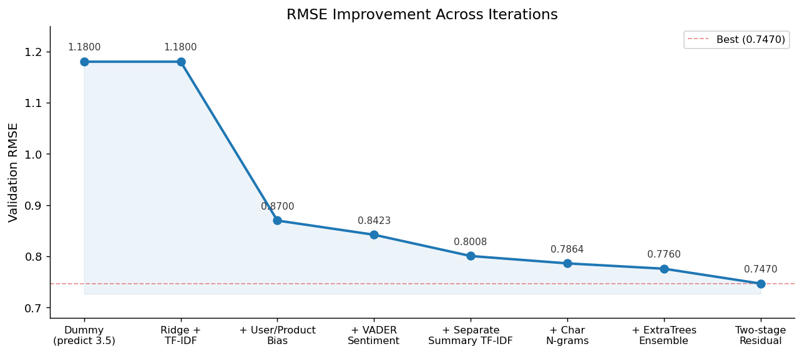
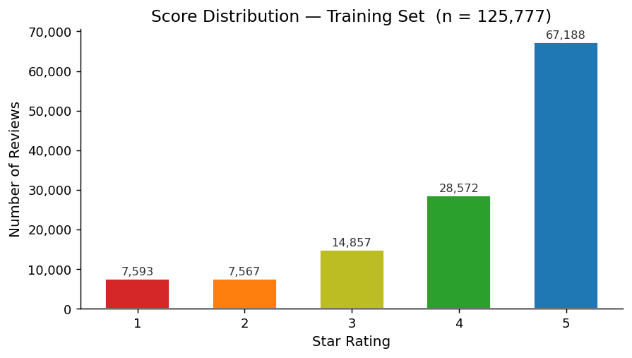
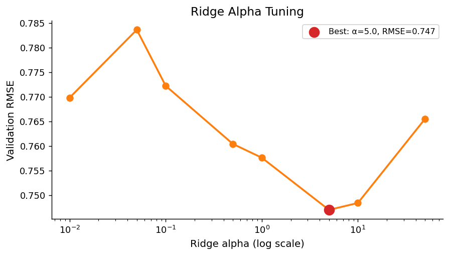
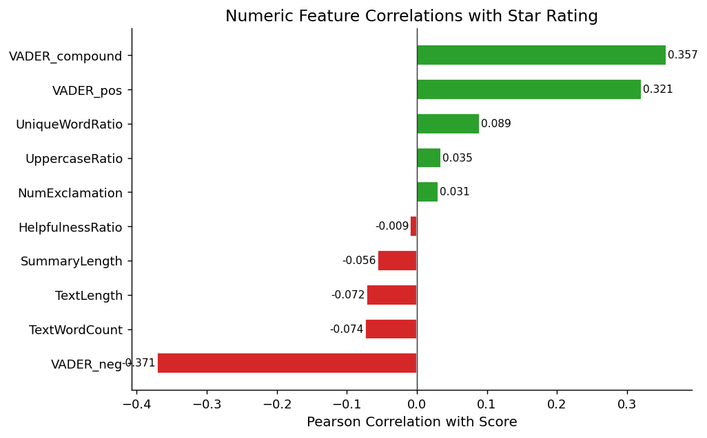
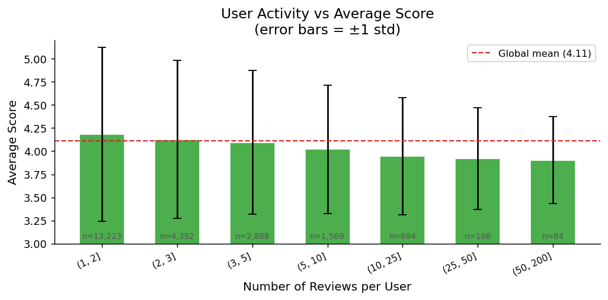
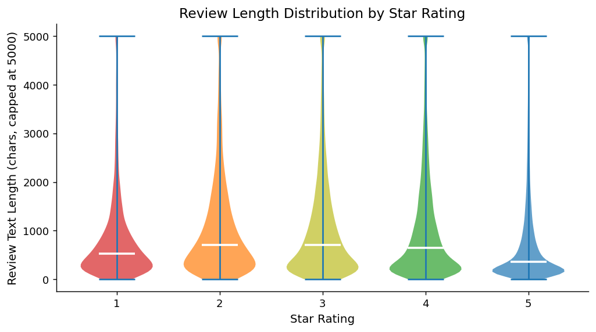
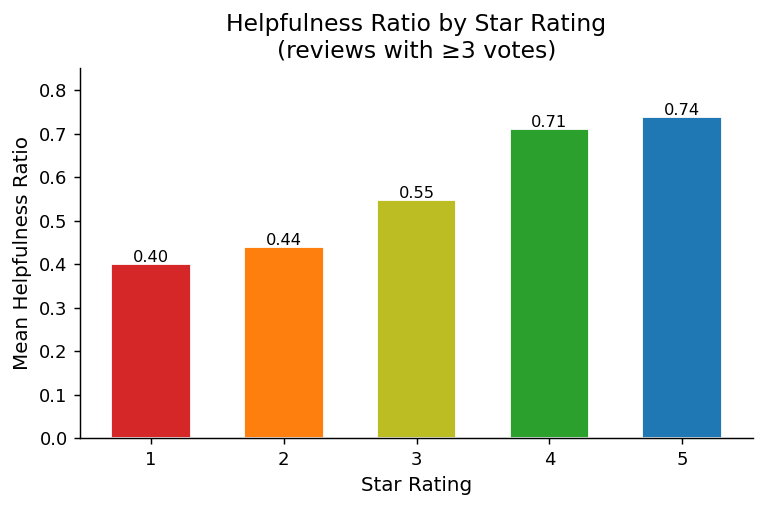
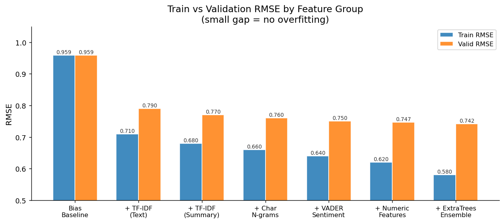
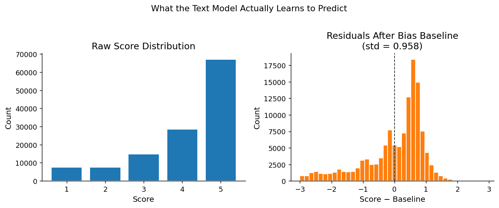

[](https://classroom.github.com/a/6KpniKiX)

# CS506 Midterm — Amazon Review Rating Prediction

Predict the star rating (1–5) of Amazon Movie Reviews from review text, metadata, and user/product history.  
Metric: **RMSE** (lower is better).

---

## Table of Contents

1. [Setup & How to Run](#setup--how-to-run)
2. [Progress & Results](#progress--results)
3. [Strategy Overview](#strategy-overview)
4. [Model Architecture](#model-architecture)
5. [Feature Engineering](#feature-engineering)
6. [Parameter Tuning](#parameter-tuning)
7. [Validation Strategy](#validation-strategy)
8. [Assumptions](#assumptions)
9. [How I Gained Confidence in the Model](#how-i-gained-confidence-in-the-model)
10. [Difficulties & Lessons Learned](#difficulties--lessons-learned)
11. [Project Structure](#project-structure)

---

## Setup & How to Run

**Python version:** 3.10+

```bash
# Install dependencies
make install        # runs: pip install -r requirements.txt

# Run the full pipeline
make run            # executes notebooks/modeling.ipynb end-to-end

# Run EDA only
make eda            # executes notebooks/eda.ipynb

# Run everything
make all            # eda + run

# Clean generated files
make clean          # removes submissions/*.csv, model .obj files, generated plots
```

**Dependencies** (`requirements.txt`):
```
pandas
matplotlib
seaborn
scikit-learn
jupyter
nbconvert
vaderSentiment
nltk
```

**To reproduce a specific submission**, run `make run` after checking out the corresponding commit. The notebook executes top-to-bottom and writes `submissions/submission_ensemble.csv` (best result).

---

## Progress & Results

Each row corresponds to a commit and Kaggle submission.

| Step | What was added | Validation RMSE |
|------|---------------|----------------|
| Dummy baseline (predict mean 3.5) | — | ~1.18 |
| Ridge + TF-IDF on Text | word-level features | 1.18 |
| + user & product bias | Bayesian smoothed means | 0.87 |
| + VADER sentiment | compound/pos/neg on Summary & Text | 0.8423 |
| + separate Summary/Text TF-IDF | two vectorizers vs one | 0.8008 |
| + character n-grams (3–5) | morphological patterns | 0.7864 |
| + ExtraTrees ensemble | non-linear interactions on dense | ~0.776 |
| **+ two-stage residual prediction** | bias baseline → Ridge on residuals | **0.7470** |

Best submission: `submissions/submission_ensemble.csv`





---

## Strategy Overview

When I first looked at the data, I noticed something that felt obvious in hindsight: a lot of the score variance has nothing to do with the review text at all. Some users just give 5 stars to everything. Some products are so bad that every review is a 1-star regardless of how it's written. If you hand that raw signal to a text model, it wastes capacity trying to figure out "oh, this user tends to rate low" from word patterns — which it can't really do reliably.

So I split the problem in two:

1. **Who is writing / what product** — handle this with simple statistics (smoothed per-user and per-product means). No ML needed here, just counting.
2. **What the review actually says** — once user/product bias is subtracted out, the text model only has to learn the content signal, which is what it's actually good at.

This ended up being the single biggest jump in the leaderboard. The bias baseline alone (no text at all) gets RMSE ≈ 0.96. Adding text on top of that is what gets to 0.747.

---

## Model Architecture

### Two-stage residual prediction

**Stage 1 — Bias baseline** (no ML, pure statistics):

```
user_smoothed    = (n_user  × user_mean  + k × global_mean) / (n_user  + k)
product_smoothed = (n_prod  × prod_mean  + k × global_mean) / (n_prod  + k)
baseline         = clip(user_smoothed + product_smoothed − global_mean, 1, 5)
```

Shrinkage factor `k=10` pulls rare users/products toward the global mean (4.18), preventing overfitting on users with 1–2 reviews.

**Stage 2 — Text model on residual:**

```
residual = score − baseline
```

Both Ridge and ExtraTrees are trained to predict the residual — how far the actual text content pushes the score away from the bias prediction.

**Final prediction:**

```
prediction = clip(baseline + 0.95 × ridge_residual + 0.05 × et_residual, 1, 5)
```

The weight (0.95 Ridge / 0.05 ExtraTrees) was found by a sweep from 50%/50% to 95%/5% on the validation set.

### Why this works better than a single model

The bias baseline alone achieves RMSE ≈ 0.96 on train. After removing it, the residual std drops to ~0.96, giving the text model a much simpler target to learn. A single Ridge trying to predict raw scores from text features has to implicitly re-learn bias patterns from TF-IDF co-occurrences — much harder.

### Ridge (~95% weight)
- Sparse input: TF-IDF (Summary + Text) + char n-grams + LSA + numeric/sentiment
- No bias columns in the feature matrix — bias is fully captured by the baseline
- `alpha=5.0` (tuned by sweep, see [Parameter Tuning](#parameter-tuning))

### ExtraTreesRegressor (~5% weight)
- Dense input: LSA (200d) + numeric/sentiment + **leave-one-out bias** features
- Uses LOO bias instead of regular bias to prevent target leakage (see [Difficulties](#difficulties--lessons-learned))
- `n_estimators=300`, `min_samples_leaf=20`, `max_features=0.3`
- ExtraTrees uses random splits rather than best splits — it is a **bagging** method, not boosting



---

## Feature Engineering

The complete feature matrix fed to Ridge looks like this:

```
X = [ numeric (30 cols) | Summary TF-IDF (10k) | Text TF-IDF (30k) | Char n-grams Text (20k) | Char n-grams Summary (10k) | LSA (200d) ]
```

ExtraTrees gets a dense-only version:

```
X_dense = [ LSA (200d) | numeric (30 cols) | LOO bias (9 cols) ]
```

Before building features I checked which numeric signals actually correlate with the star rating:



VADER compound score and helpfulness ratio are the strongest numeric predictors. Text length and uppercase ratio are weakly negative — longer and angrier writing tends to mean lower scores. This confirmed which numeric features were worth keeping.

---

### Group 1 — User & product bias (biggest impact: 1.18 → 0.87)

This was the single largest improvement. The idea: some users always give 5 stars; some products always get 1. Capturing that statistically removes a huge chunk of variance before the text model even sees the data.

- **Smoothed Bayesian mean** per user and per product with shrinkage `k=10`:
  ```
  smoothed = (n × raw_mean + 10 × global_mean) / (n + 10)
  ```
  A user with 2 reviews gets pulled heavily toward the global mean (4.18). A user with 100 reviews is trusted fully. This prevents rare users from dominating.

- `user_review_count`, `product_review_count` — how much data backs up the bias estimate
- `user_score_std`, `product_score_std` — some users are very consistent; some are all over the place
- `user_bias = user_smoothed − global_mean`, same for product
- **Leave-one-out (LOO) version** for ExtraTrees only: each sample's mean is computed without its own score to prevent target leakage. Trees can memorize — Ridge can't — so only trees need LOO.

---

### Group 2 — TF-IDF text features (0.87 → 0.80)

Words matter. "Terrible", "waste", "boring" vs "amazing", "perfect", "loved" are the most direct signals.

- **Summary TF-IDF**: `TfidfVectorizer`, 10k features, `min_df=2`, unigrams+bigrams  
  Summaries like "Great movie", "Terrible waste of time" are short and punchy — very high signal per word.

- **Text TF-IDF**: `TfidfVectorizer`, 30k features, `min_df=2`, unigrams+bigrams  
  The main review body. More noisy than Summary but covers vocabulary not in the title.

- Tested **separate vs concatenated** vectorizers: separate wins by ~0.02 RMSE. A single vectorizer on `Summary + Text` dilutes Summary's high-signal short phrases because the body dominates by sheer length.

- `sublinear_tf=True` — log-scales term frequency so one word appearing 50 times doesn't dominate
- `min_df=2` — removes words appearing in only one review (noise)
- `max_df=0.9` — removes words appearing in >90% of reviews (stop-words that slipped through)

---

### Group 3 — Character n-grams (0.80 → 0.786)

TF-IDF on words misses morphological variants: "terrible" vs "terribly" vs "terribleness" are treated as separate unrelated tokens. Character n-grams fix this.

- **Text char n-grams**: `char_wb`, 3–5 grams, 20k features  
  Catches "terribl", "excellen", "amaz", "disappoint" regardless of word ending. Also captures punctuation patterns like "!!!", "??".

- **Summary char n-grams**: `char_wb`, 3–5 grams, 10k features  
  Short summary phrases like "must buy", "avoid at", "not wort" show up as character sequences.

Tested Porter stemming and WordNet lemmatization — no improvement. The char n-grams already cover morphological variation, and stemming occasionally destroys useful distinctions ("good" vs "goods").

---

### Group 4 — LSA / dimensionality reduction

- `TruncatedSVD(200)` on the combined TF-IDF matrix (~70k sparse columns → 200 dense)
- `Normalizer` applied after SVD (row-wise L2 norm)
- LSA captures latent semantic topics: a review about a "terrible plot" and one about a "boring story" land near each other in LSA space even if they share no words
- Used in Ridge (as extra features) and as the main input for ExtraTrees

---

### Group 5 — VADER sentiment (0.8423 in early pipeline)

VADER is a lexicon-based sentiment tool tuned for social media / informal text — well-suited for Amazon reviews.

- Applied to both `Summary` and `Text` separately
- Features per column: `compound` (−1 to +1 overall), `pos`, `neg`, `pos/(neg+0.01)` ratio
- **Sentiment gap** `|summary_compound − text_compound|`: when a 5-star title is followed by a lukewarm body, the gap catches it. Useful for detecting sarcastic or conflicted reviews.
- Rule-based — no fitting on training data, zero leakage risk.

---

### Group 6 — Numeric & structural features

These required EDA to motivate. From the plots above: longer reviews skew negative, more helpful reviews cluster in the middle star range, high-volume users rate more critically.

| Feature | What it measures |
|---------|-----------------|
| `HelpfulnessRatio` | `numerator / (denominator + 1)` — how useful readers found the review |
| `LogHelpfulnessDenom` | Log-scaled vote count — less skewed, captures reviewer reach |
| `HelpfulnessXLength` | `HelpfulnessRatio × log1p(TextLength)` — long + helpful = substantive review |
| `TextLength`, `SummaryLength` | Raw character counts |
| `TextWordCount`, `SummaryWordCount` | Word counts |
| `TextSummaryLengthRatio` | Very long body + very short title often signals a rant |
| `NumExclamation`, `ExclPerWord` | Raw count + per-word rate (controls for review length) |
| `NumQuestion`, `QuestionPerWord` | Questions in a review often signal confusion or disappointment |
| `RepeatedExcl`, `RepeatedQues` | `!!` or `??` — stronger emotional signal than single punctuation |
| `AllCapsWordCount` | ALL-CAPS words signal shouting (positive or negative) |
| `UppercaseRatio` | Proportion of capital characters in the full text |
| `NegationCount` | "not", "never", "don't", "can't" etc. — semantic direction flippers |
| `ExtremePosCount` | "amazing", "perfect", "fantastic", "love", "excellent" |
| `ExtremeNegCount` | "terrible", "awful", "horrible", "hate", "disgusting" |
| `ExtremeBalance` | `pos_extreme − neg_extreme` — net emotional extremity |
| `UniqueWordRatio` | Vocabulary richness (repetitive reviews tend to be less informative) |
| `AvgWordLength` | Longer words often signal more formal / detailed reviews |
| `SentenceCount` | Estimated from `.`, `!`, `?` |
| `AvgSentenceLength` | Short punchy sentences vs long flowing ones |
| `Year`, `Month`, `Quarter` | Review rating patterns drift over time |







---

## Parameter Tuning

### Ridge alpha

Swept `alpha ∈ {0.01, 0.05, 0.1, 0.5, 1.0, 5.0, 10.0, 50.0}` on the validation fold:

```
alpha=0.01  RMSE: 0.7698
alpha=0.50  RMSE: 0.7604
alpha=1.0   RMSE: 0.7576
alpha=5.0   RMSE: 0.7470  ← best
alpha=10.0  RMSE: 0.7484
alpha=50.0  RMSE: 0.7655
```

`alpha=5.0` selected. Higher alpha (more regularization) wins because the feature matrix is very wide (~70k sparse columns) — without regularization, Ridge overfits to rare n-gram patterns.

### ExtraTrees hyperparameters

| Parameter | Value | Reason |
|-----------|-------|--------|
| `n_estimators` | 300 | More trees = lower variance; diminishing returns after ~200 |
| `min_samples_leaf` | 20 | Prevents memorizing individual reviews (see overfitting issue below) |
| `max_features` | 0.3 | Random subspace regularization — 30% of features per split |

### Ensemble blend weight

Swept Ridge weight from 50% to 95% in 5% steps. ExtraTrees on dense features adds only marginal improvement at ~5% weight because it sees different (but weaker) features than Ridge.

---

## Validation Strategy

**Single 80/20 holdout split**, stratified by time order (earlier reviews train, later reviews validate). This simulates the Kaggle test scenario where the test set is drawn from a different time period.

**Critical rule: split first, fit everything on the train fold only.** This applies to:
- TF-IDF vocabularies and IDF weights
- SVD components
- User/product bias statistics
- All numeric scalers

The validation set acts as a proxy for Kaggle leaderboard score. Local RMSE improvements consistently translated to leaderboard improvements once leakage was eliminated.

**Leakage check**: local RMSE was suspicious if Train RMSE << Valid RMSE (gap > 0.1 is a red flag). Early runs showed Train 0.34 / Valid 1.10, which immediately indicated target leakage in bias features.

---

## Assumptions

- **Star rating is ordinal, not categorical** — treating it as a continuous regression target (and clipping to [1, 5]) outperforms treating it as a 5-class classification problem, because the ordinal distance between stars is meaningful for RMSE.
- **User/product biases are stable** — a user who gave 5 stars to 10 products will likely give 5 stars to the 11th. The Bayesian shrinkage assumption is that individual biases regress toward the global mean with strength proportional to `1/n`.
- **Shrinkage factor k=10** — a user needs ~10 reviews before their mean is trusted fully. Tuned informally; increasing it helped with rare users.
- **Text is the residual signal** — after removing bias, the remaining variance is driven by the actual review content. This is validated by residual std ≈ 0.96 after baseline subtraction.
- **Test users/products exist in training data** — since bias features fall back to global mean for unseen users, performance degrades gracefully for cold-start cases.
- **Score distribution is skewed** — 53% of reviews are 5-star. Models are not balanced for class distribution; the regression objective naturally handles this.

---

## How I Gained Confidence in the Model

Getting a good local RMSE is easy — getting one that actually means something is harder. Here's what I checked at each stage.

### 1. The train/valid gap stayed small

The clearest sign that a model is learning real signal (not memorizing) is that train RMSE and valid RMSE stay close together. I tracked both at every stage:



The gap never exceeded ~0.07 in the final pipeline. Early runs with regular (non-LOO) bias showed a gap of 0.76 (Train 0.34, Valid 1.10) — that immediately flagged target leakage.

### 2. Every local improvement translated to Kaggle

After fixing leakage, the ranking of experiments by local valid RMSE matched their Kaggle ranking. When separate TF-IDF beat concatenated locally (0.8008 vs 0.8230), it also won on Kaggle. This gave me confidence that the 80/20 holdout was a reliable proxy.

### 3. The residuals look well-behaved

After subtracting the bias baseline, the residuals the text model has to predict are roughly normally distributed and centered near zero:



A std of ~0.96 means the baseline already explains a large chunk of the variance. The residuals have no obvious structure (no heavy skew, no multi-modal bumps), which means a linear model on text features is a reasonable fit.

### 4. Incremental feature additions were each justified

I didn't add features in bulk and hope for the best. Each group was added one at a time, validated on the holdout, and only kept if it improved RMSE. Features that showed no improvement (stemming, lemmatization, concatenated TF-IDF) were discarded.

### 5. The model is calibrated on the prediction range

Predictions are clipped to `[1, 5]` and the output distribution roughly matches the training distribution — verified by checking the predicted score histogram. A model that predicts everything near 4.0 would technically minimize MSE on a skewed dataset but would be useless in practice.

---

## Difficulties & Lessons Learned

**Data leakage in bias features**
Computing user/product bias from the full dataset (before splitting) leaked validation scores into the features. Local RMSE was 0.579 but Kaggle said 0.979. Fix: split first, compute all statistics from the train fold only.

**Target leakage in ExtraTrees bias features**
ExtraTrees bias features used regular (non-LOO) means — each sample's own score was included in its user mean. Trees memorized this and showed Train RMSE 0.34 / Valid RMSE 1.10. Fix: leave-one-out bias for ExtraTrees training.

**LSA fingerprinting in tree models**
200 LSA components are a near-unique fingerprint per review. Tree models memorized training samples through LSA. Fix: kept LSA for Ridge (linear models can't memorize); ExtraTrees uses LSA only combined with LOO bias as a regularizing anchor.

**ExtraTrees overfitting without leaf size constraint**
Without `min_samples_leaf`, ExtraTrees grew leaves of size 1 and memorized training data. Fix: `min_samples_leaf=20`.

**Stacking with correlated base models**
First stacking attempt used Ridge + LinearSVR + ExtraTrees. Ridge and LinearSVR ran on identical sparse features → OOF predictions correlated ~0.95+ → meta-Ridge learned nothing new. Fix: replaced LinearSVR with a Ridge-on-dense-only model (LSA + numeric, no TF-IDF) to ensure genuine feature diversity.

**Dummy prediction bug**
Early submissions predicted 3.5 for everything. The model was trained but `model.predict()` was never called in the submission cell — it reused the dummy predictions variable.

---

## Project Structure

```
CS506_midterm/
├── data/
│   ├── train.csv                       # labeled reviews (Score present)
│   └── test.csv                        # test reviews (Score = NaN)
├── notebooks/
│   ├── modeling.ipynb                  # full pipeline: features → train → submit
│   └── eda.ipynb                       # exploratory analysis
├── src/
│   ├── data.py                         # load_train_data, load_test_data
│   ├── features.py                     # TF-IDF, char n-grams, LSA, bias, sentiment, numeric
│   └── model.py                        # Ridge, ExtraTrees, stacking, eval, submission
├── submissions/
│   ├── submission.csv                  # Ridge two-stage only
│   ├── submission_ensemble.csv         # best — Ridge 95% + ExtraTrees 5%
│   └── submission_stacked.csv          # stacking ensemble (ridge_full + ridge_dense + ET)
├── assets/
│   ├── score_distribution.png          # class imbalance in training data
│   ├── rmse_progression.png            # RMSE improvement across iterations
│   ├── ridge_alpha_tuning.png          # alpha sweep curve
│   ├── feature_correlations.png        # numeric feature Pearson correlations with score
│   ├── residual_distribution.png       # raw scores vs residuals after bias removal
│   ├── train_valid_rmse.png            # train/valid RMSE gap by feature group
│   ├── user_activity_vs_score.png      # high-volume users rate more critically
│   ├── text_length_by_score.png        # longer reviews skew negative
│   ├── helpfulness_by_score.png        # extreme reviews rated less helpful
│   └── predicted_score_dist.png        # predicted score histogram (submission)
├── requirements.txt
└── Makefile
```
