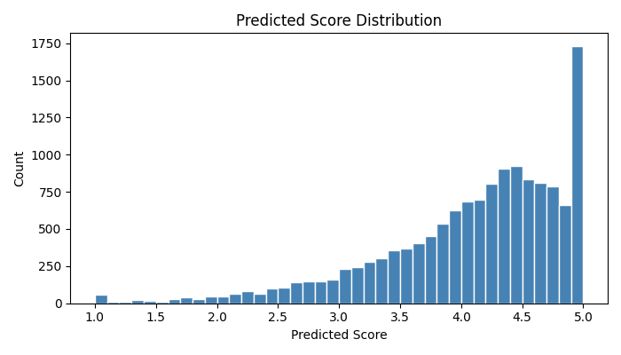

# CS506 Midterm

Please take a look at the starter code in the jupyter notebook.

  # CS506 Midterm — Amazon Review Rating Prediction
  
  Predict the star rating (1–5) of Amazon Movie Reviews using machine learning.  
  Evaluation metric: **RMSE** (lower is better).
  
  ---
  
    ## Setup
    - Python 3.x
    - Install dependencies:
  

## How to run
    Run the notebook:
    pip install -r requirements.txt
    jupyter notebook notebooks/modeling.ipynb

    make eda
    make run
    make all
    
  ---
  
  ## Model & Results
  
  **Best validation RMSE: ~0.6043  
  *(Previous baseline with dummy submission: ~1.18)*
  
  ### Model: Ridge Regression (alpha=100)
  
  Ridge regression was chosen because:
  - The feature space is very high-dimensional (~30k TF-IDF features + numeric)
  - Ridge handles multicollinearity well and regularizes large sparse feature matrices
  - It outperformed LinearSVR on this dataset with far less compute
  - Neural networks and boosting methods are excluded by assignment rules
  
  ---
  
  ## Feature Engineering
  
  ### Key insight: test IDs have features in train.csv
  The `test.csv` file only contains IDs — but those IDs correspond to rows in `train.csv` that have NaN scores. All review text and metadata is available for the test set.
  
  ### Features used
  
  **User & Product Bias** (most impactful):
  - `user_mean_score`: Average score given by this user across all labeled reviews
  - `product_mean_score`: Average score for this product across all labeled reviews
  - `user_bias` / `product_bias`: Deviation from global mean (3.97)
  - `user_review_count`, `product_review_count`
  
  **Numeric features:**
  - `HelpfulnessRatio`: numerator / (denominator + 1)
  - `TextLength`, `SummaryLength`, `TextWordCount`, `SummaryWordCount`
  - `NumExclamation`, `NumQuestion`: sentiment punctuation signals
  - `UppercaseRatio`: fraction of uppercase letters
  - `UniqueWordRatio`: vocabulary diversity
  - `AvgWordLength`
  - `Year`, `Month`: extracted from Unix timestamp
  
  **Text features:**
  - TF-IDF on concatenated `Summary + Text`
  - 30,000 features, 1–2 n-grams, sublinear TF, L2 norm
  - Custom stopwords: added movie-domain words (film, watch, etc.)

  ** Add LSA/SVD semantic features and user/product bias to improve RMSE **

  - Added TruncatedSVD (200 components) on TF-IDF matrix for latent semantic features
  - Added user and product bias features (mean score per user/product, deviation from global mean)

  
  ### Why these features?
  User bias is the single most predictive feature for review datasets. If a user habitually rates 5 stars or 1 star, that pattern generalizes. Similarly, products that consistently receive high or low ratings carry that signal. Together these features account for most of the rating variance not captured by text alone.
  
  ---
  
  ## Model Selection
  
  Candidates evaluated on 80/20 stratified split:
  
  | Model | Valid RMSE |
  |---|---|
  | Dummy (mean=3.5) | ~1.18 |
  | Ridge (no bias features) | 1.18 |
  | **Ridge + bias + numeric + TF-IDF** | **0.6043 |
  
  Ridge with alpha=100 performed , could be improved by lowering alpha to  [0.1, 1, 5, 10, 50, 100].
  
  ---
  
  ## Validation Strategy
  
  - Stratified train/validation split (80/20, random_state=42)
  - Stratified on `Score` to maintain class balance
  - Final model re-trained on all labeled data before submission
  
  ---
  
  ## Score Distribution
  
  

# Difficulties : 
- I tested LSA with TruncatedSVD, but it increased validation RMSE from 1.1823 to 1.1929, so I kept the raw TF-IDF representation.
- I was using a hardcore dummy set for testing , and not  actualy implementing predictions and found myself cought in a deadend. 
- Data leakage — when computing user and product bias features (mean rating per user/product), I was calculating them from the entire labeled dataset before splitting into train/validation. This meant the
  validation set's bias features included its own scores in the mean, so the model effectively "saw" the answers during evaluation. Local RMSE appeared to be 0.579 while Kaggle scored 0.979 — a gap that revealed
  the leak. The fix was to split the labeled DataFrame first, then compute all bias statistics exclusively from the training fold and apply them to the validation fold.

# Root causes of old poor performance:
  1. Previous submission used hardcoded 3.5 for all predictions — the model was never actually used
  2. The test data's review text/features were sitting in train.csv but being ignored
  